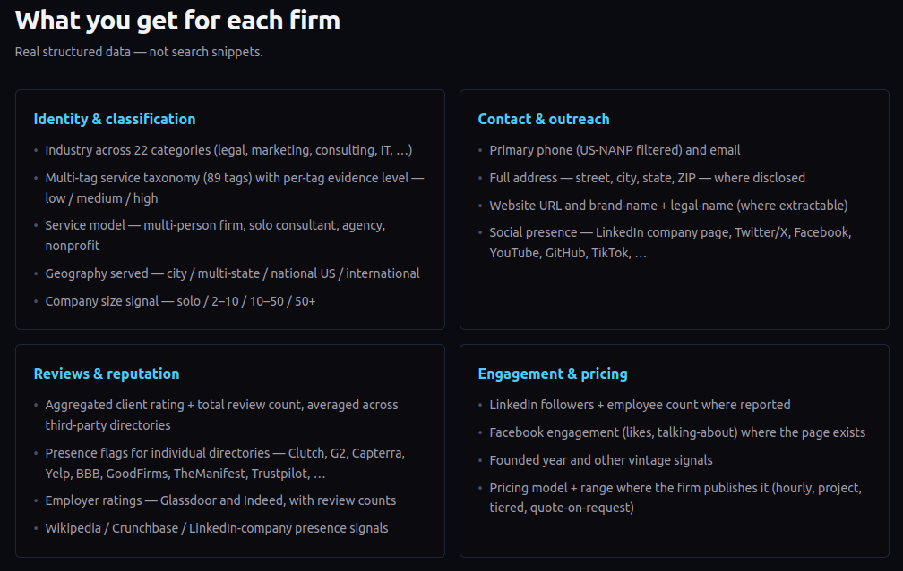

<p align="center">
  
</p>

# ServiceGraph Agent Skills

> Stop scraping. Your agent's directory of US service firms is here.

Agent Skills for [**ServiceGraph**](https://servicegraph.co) — a structured
catalog of **100k+ US professional-services firms** (law, marketing,
consulting, accounting, IT services, architecture, engineering, HR, PR,
design) with filters for industry, services offered, location, size, ratings,
and third-party listing presence.

<p align="center">
  
</p>

Compatible with **19+ AI agents** including Claude Code, Codex, Cursor, GitHub
Copilot, Gemini, Cline, Goose, Windsurf, and any other harness that supports
the [Agent Skills](https://agentskills.io/) format.

## Installation

### Install a specific skill

```bash
npx skills add nostrband/servicegraph --skill find-service-providers
```

### Install all skills

```bash
npx skills add nostrband/servicegraph
```

No signup is needed for catalog discovery (`/v1/tags`, `/v1/check`,
`/v1/explore`). Skills prompt the user for an email + one-time code only when
they reach the contact-info tier (`/v1/search`, `/v1/get`).

## Available Skills

<details open>
<summary><strong>find-service-providers</strong> — the umbrella skill</summary>

Find, shortlist, vet, or enrich US professional-services firms across all 22
industries in the catalog — law, marketing, consulting, accounting, IT
services, architecture, engineering, HR, PR, design, and more.

**Use when:**
- "Find me three boutique IP law firms in California"
- "Build a longlist of 50 mid-size US management consultancies"
- "Here are 12 agency domains — pull contact info and confirm which are US-based"
- The user's intent doesn't fit a more specific skill below

</details>

<details>
<summary><strong>find-marketing-agency</strong></summary>

Find US marketing agencies — branding, content marketing, PPC/paid media,
social, email, performance/demand-gen, video production, full-service digital.
Auto-pins `industry:marketing_agency` so the agent doesn't have to.

**Use when:**
- "Shortlist three B2B branding agencies in California"
- "Find a PPC shop with ecommerce experience"
- "We need a content marketing partner for a SaaS launch"

</details>

<details>
<summary><strong>find-seo-agency</strong></summary>

Find US SEO agencies — technical, on-page/off-page, link-building,
content-led, local, ecommerce, B2B SEO, audits. Auto-pins
`industry:marketing_agency service_provided:seo`.

**Use when:**
- "Find me an SEO agency in Texas"
- "Shortlist three technical SEO consultancies for SaaS"
- Indirect phrasings: "organic traffic is flat", "improve our Google rankings"

</details>

<details>
<summary><strong>find-software-developer</strong></summary>

Find US software development firms — custom software, web/mobile development,
backend/API, DevOps, cloud consulting, system integration, hosting, managed
IT. Auto-pins `industry:it_services`.

**Use when:**
- "Find me a software dev shop in Austin"
- "Shortlist three custom-software firms with healthcare experience"
- "We need a mobile app developer for our iOS launch"

</details>

### Coming soon

Industry-specific skills are rolling out to bring the catalog's 22 industries
to first-class coverage — `find-web-developer`, `find-law-firm`,
`find-consulting-firm`, `find-accounting-firm`, `find-pr-agency`, and more.
Until they ship, the umbrella `find-service-providers` skill handles every
industry through the same DSL.

## Prefer MCP? Use the hosted server.

If your harness speaks the [Model Context Protocol](https://modelcontextprotocol.io/),
skip the skill install and point it at the hosted MCP server:

```
https://mcp.servicegraph.co
```

- **Transport:** Streamable HTTP
- **Auth:** OAuth 2.1 + PKCE with Dynamic Client Registration — your
  harness opens a browser tab on first use; the user enters their email +
  one-time code on `api.servicegraph.co` and is bounced back. No client
  ID or secret to copy around.

### Claude Code

```bash
claude mcp add --transport http servicegraph https://mcp.servicegraph.co
```

### Claude Desktop

**Settings → Connectors → Add custom connector**, then paste:

```
https://mcp.servicegraph.co
```

The OAuth handshake runs in your browser on first use.

### Codex CLI

`~/.codex/config.toml`:

```toml
[mcp_servers.servicegraph]
url = "https://mcp.servicegraph.co"
```

### Cursor and other JSON-config clients

`.cursor/mcp.json` (or the equivalent for your harness):

```json
{
  "mcpServers": {
    "servicegraph": {
      "url": "https://mcp.servicegraph.co"
    }
  }
}
```

## Usage

Skills are automatically available once installed. The agent will pick the
right one when it detects a relevant task.

**Examples:**

```
Find me three boutique IP law firms in California that handle patent
prosecution for hardware startups.
```

```
Need a shortlist of mid-size SEO agencies in NY or NJ with a strong B2B
SaaS portfolio.
```

```
We're hiring a CPA firm for a Delaware C-corp Series A audit.
Recommend 5 options under 50 people.
```

```
Here are 12 marketing agency domains I scraped — pull contact info and
confirm which are in the US.
```

## How it works — the four-tier funnel

```
GET /v1/tags         →  field catalog · free · anonymous
GET /v1/check        →  validate filter · free · anonymous
GET /v1/explore      →  counts + breakdowns · free · anonymous
GET /v1/search       →  brief firm cards · 200/month free
GET /v1/get/{id}     →  full bundle (url, phone, email) · 50/month free
```

Skills know to walk down the funnel: cheap tiers first, expensive tiers only
on shortlisted firms. Re-pages and overlapping queries are free — the quota
counts only **unique** firm-views per calendar month.

### Filter DSL

One query parameter, GitHub-search-style. AND binds tighter than OR;
`-x` / `NOT x` for negation; `tag@evidence` for the `service_provided` field.
Any bareword is a free-text keyword search across firm name, brand, title,
meta description, and legal name.

```
industry:legal state:CA,NY -company_size_signal:solo
industry:management_consulting service_provided:strategy-consulting@high
dental industry:marketing_agency
rating>=4 review_count_total>=20 has:clutch
(web3 OR blockchain) state:CA
```

Field catalog (kinds, operators, allowed values) is discoverable at runtime
via [`/v1/tags`](https://api.servicegraph.co/v1/tags).

## Why structured beats search

- **Filter, don't grep.** Industry, services, location, size, rating,
  third-party listings — all queryable as a single filter string. Not a wall
  of fuzzy web results.
- **Try before you sign up.** `/v1/explore` is fully anonymous. Get counts
  and breakdowns for any filter to size the candidate pool before spending an
  API call.
- **Quota rewards focus.** 200 unique firm-views per month free. Re-paging
  or overlapping queries are free; only new firms count.

## Skill structure

Each skill follows the [Agent Skills Open Standard](https://agentskills.io/):

- `SKILL.md` — required manifest with frontmatter (name, description, metadata)

The skills in this repo are single-file. No bundled scripts or references
yet — the API is small enough that the agent does fine with prose +
copy-pasteable curl examples.

## Links

- [API console & docs](https://docs.servicegraph.co)
- [OpenAPI 3.1 spec](https://api.servicegraph.co/openapi.json)
- [Field catalog](https://api.servicegraph.co/v1/tags) — live list of every
  filterable field, kind, and allowed value
- [llms.txt](https://servicegraph.co/llms.txt)
- [Site](https://servicegraph.co)

## License

MIT

## Contact

[artur@servicegraph.co](mailto:artur@servicegraph.co)
